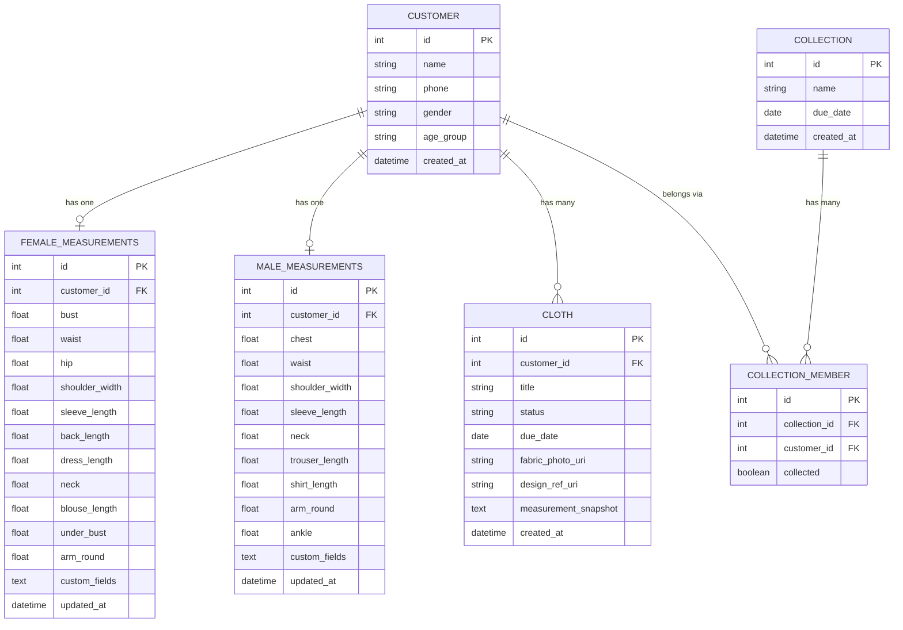

# Snips

A mobile-first tailoring management app for Nigerian tailors. Snips helps you manage customer measurements, track cloth orders, and organise group collections — all offline, all from your phone.

---

## Table of Contents

- [Concept](#concept)
- [Tech Stack](#tech-stack)
- [Design System](#design-system)
- [Screens](#screens)
- [Data Model](#data-model)
- [Measurements](#measurements)
- [Navigation](#navigation)
- [Features](#features)
- [Roadmap](#roadmap)

---

## Concept

Built like a note-taking app. Every customer is a canvas. Tap to edit. Enter to move to the next field. No modals, no unnecessary steps — just fast, fluid data entry for a tailor in the middle of work.

---

## Tech Stack

| Layer | Choice |
|---|---|
| Framework | Expo (React Native) |
| Navigation | React Navigation — right-side drawer |
| Storage | Local-first, Expo SQLite |
| Camera | Expo ImagePicker |
| Date picker | Expo DateTimePicker |
| Fonts | Border Wall Font + Caveat Brush Light |
| Future | Cloud sync for premium users (Play Store) |

---

## Design System

### Colours

| Role | Hex |
|---|---|
| Primary / Action | `#E43636` |
| Background / Canvas | `#F6EFD2` |
| Border / Muted surface | `#E2DDB4` |
| Text / Logo | `#000000` |

### Status Colours

| Status | Background | Text |
|---|---|---|
| CUT | `#FDE68A` | `#92400E` |
| SEWN | `#BFDBFE` | `#1E40AF` |
| READY | `#BBF7D0` | `#166534` |
| OVERDUE | `#FECDD3` | `#9F1239` |

### Typography

| Role | Font |
|---|---|
| Display / Headings | Border Wall Font |
| Body / UI | Caveat Brush Light |

### Logo

Scissors crossing a fountain pen, with a red pivot dot. Used as the app icon and top bar mark. Sits beside the "Snips" wordmark in Border Wall Font.

### Other

- Dark mode supported from day one
- Haptic feedback on FAB expand, checkbox tick, status change, and success actions
- No input borders — values look like plain text until tapped (canvas-style)
- ENTER key moves focus to the next field

---

## Screens

| Screen | Description |
|---|---|
| Onboarding | One-time setup: tailor selects Female only / Male only / Both |
| Queue (Home) | Nested list of customers with active cloths, sorted by nearest due date |
| Customer List | All customers, sortable by A–Z, last created, or due date |
| Customer Profile | Canvas-style page: name, phone, gender, age group, measurements, cloths |
| Cloth Detail | Notepad-style canvas: cloth info, inherited measurements, photos, status |
| Collection List | All collections with progress summary |
| Collection Detail | Members list with status pills and collected checkboxes |

### Global UI

- **Search bar** — present on every page, expands fullscreen, background blurs while active, live results as you type
- **FAB** — bottom left, present on every page, hidden when any flow is open

### FAB Options (Google Keep style, expands upward)

| Option | Flow |
|---|---|
| Cloth | Search customer → cloth form (inherits measurements) |
| Measurement | Search customer → navigate to profile → measurement section |
| Customer | Bottom sheet → name, phone, gender, age group |
| Collection | Bottom sheet → name, due date, add members |

---

## Data Model

### Notes

- A customer has either `female_measurements` or `male_measurements` depending on their gender — never both
- `CLOTH.measurement_snapshot` stores a JSON copy of the customer's measurements at the time the cloth was created. Old cloths are never affected when body measurements change
- `custom_fields` on both measurement tables is a JSON array: `[{ "label": "Stomach", "value": "36" }, ...]`
- `COLLECTION_MEMBER.collected` is the checkbox the tailor ticks on collection day

---

## Measurements

### Female

| Field |
|---|
| Bust |
| Waist |
| Hip |
| Shoulder width |
| Sleeve length |
| Back length |
| Dress length |
| Neck |
| Blouse length |
| Under bust |
| Arm round |
| + custom fields |

### Male

| Field |
|---|
| Chest |
| Waist |
| Shoulder width |
| Sleeve length |
| Neck |
| Trouser length |
| Shirt length |
| Arm round |
| Ankle |
| + custom fields |

### Display Rule

On the measurement canvas, filled fields appear first, blank fields appear below them, custom fields appear at the bottom.

---

## Navigation

- Right-side hamburger drawer `[≡]` in the top bar
- Drawer slides in from the right
- Three sections: **Queue**, **Customers**, **Collections**
- Top bar layout: `[ Snips logo ]  [ search bar ]  [ ≡ ]`

---

## Features

### Customer management
- Add customers with name, phone, gender, age group (Adult / Child)
- Gender-specific measurement forms
- Canvas-style profile page — tap any value to edit, ENTER moves to next field
- Customers can belong to multiple collections

### Cloth tracking
- Each cloth inherits the customer's body measurements at creation
- Tailor can override any measurement value per cloth
- Attach fabric photo and design reference photo
- Due date with calendar picker
- Linear status flow: CUT → SEWN → READY
- Overdue detection — red indicator when due date has passed and cloth is not READY

### Queue
- Home screen shows all active (non-READY) cloths
- Grouped by customer, sorted by nearest due date
- Collapsible customer sections
- Overdue cloths highlighted in red

### Collections
- Group customers (families, wedding parties, events)
- Collective due date per collection
- Member list with cloth status and collected checkbox
- Progress summary on collection cards (ready / in progress / not started)

### Search
- Global search bar, always visible
- Fullscreen overlay on tap, background blurs
- Live results as you type
- Searches across customer names, cloth titles, collection names

### Onboarding
- First launch only
- Tailor selects: Female only / Male only / Both
- Controls which gender flows and measurement tables are active
- Changeable later in settings

---

## Roadmap

### Now
- Core app: customers, measurements, cloths, collections, queue

### Later (Premium / Play Store)
- Cloud sync across devices
- Schedule section for planning completions
- Measurement units preference (inches / cm)
- Export customer data